  

  
  
  
  

### `$ whoami`

- 🧑‍💻 Software engineer from Taiwan, pushing code to GitHub since 2012.
- 📓 I learn in public: notebooks for Go, Python, PostgreSQL, Docker, Kubernetes, AWS and Azure.
- 🕷️ Wrote crawlers with Scrapy, solved Codility in Python, tinkered with HITCON CTF challenges.
- 🤖 Pair-programming with Claude Code these days. It built this page, Clawd included.
- ✍️ Notes and write-ups live on [my blog](https://cain19811028.blogspot.tw/).

### `$ ls ~/stack`

<picture>
  <source media="(prefers-color-scheme: dark)" srcset="https://skillicons.dev/icons?i=python%2Cgo%2Cjs%2Cts%2Cnodejs%2Cangular%2Cpostgres%2Cdocker%2Ckubernetes%2Caws%2Cazure%2Clinux%2Cgit%2Cgitlab%2Cvscode&theme=dark&perline=15">
  
</picture>

### `$ cat stats.json languages.yml`

  
  

### `$ tail contributions.log`

### `$ ls ~/projects --pinned`

<!-- projects:start -->
| Project | About | Language | ★ |
| --- | --- | --- | ---: |
| [**python-codility**](https://github.com/cain19811028/python-codility) | 使用 Python 練習 Codility 的題目 | Python | 11 |
| [**py-transfermarkt-crawler**](https://github.com/cain19811028/py-transfermarkt-crawler) | get Eternal Table data in www.transfermarkt.co.uk | Python | 2 |
| [**poke-rotom**](https://github.com/cain19811028/poke-rotom) | ⚡ Rotom Pokédex for AI Agents: Lightweight Pokémon MCP Server & Skill. Multi-lang (EN/ZH/JA), Battle Stats & Weaknesses, Official HD Sprites, and 99.6% Token Savings! | JavaScript | 0 |
| [**github-trending-radar**](https://github.com/cain19811028/github-trending-radar) | Daily GitHub Trending radar: first-time entries, breakouts, AI spotlight and non-AI gems | — | 0 |
<!-- projects:end -->

---

The images and the table above regenerate every 6 hours via <a href=".github/workflows/profile-readme.yml">GitHub Actions</a> (<a href="scripts/build_profile.py">source</a>). Clawd is the mascot of Anthropic's Claude.
